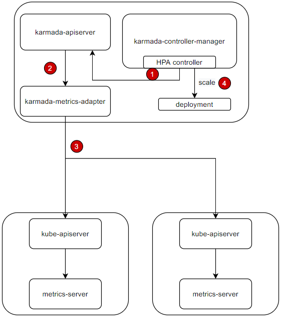

对于跨集群部署并需要弹性伸缩，以处理不同请求数的工作负载，Karmada 的 `FederatedHPA` 提供了跨集群弹性伸缩工作负载的能力，并带来以下核心优势：
* 协调多个集群的资源，跨集群弹性伸缩工作负载。
* 统一、高效地配置跨集群弹性伸缩。
* 避免单点故障导致断服，跨集群弹性伸缩提升工作负载稳定性。
* 统一限制负载在多个集群中的资源使用。

Karmada `FederatedHPA` 总体架构如下：  


1. HPA控制器周期使用 label selector 通过 metrics API `metrics.k8s.io` 查询指标。
1. `karmada-apiserver` 收到 metrics API 查询，并通过 API service 将其路由到 `karmada-metrics-adapter`。
1. `karmada-metrics-adapter` 从目标集群（pod所在的位置）中查询 metrics。收集完毕后，它会对其进行聚合并返回结果。
1. HPA控制器将根据 metrics 计算所需副本数，并直接扩展工作负载。然后，`karmada-scheduler` 将把这些副本调度到成员集群。

> 注意: 使用该特性需要满足 Karmada 版本在v1.6.0以上（包含v1.6.0）。


## 准备开始

### 安装Karmada

我们可以通过参考[快速开始](https://github.com/karmada-io/karmada#quick-start)来安装Karmada，或者直接运行 `hack/local-up-karmada.sh` 脚本，我们的E2E测试执行正是使用了该脚本。

### 成员集群网络

确保至少有两个集群被添加到 Karmada，并且成员集群之间的容器网络可相互连接。

- 如果你使用 `hack/local-up-karmada.sh` 脚本来部署 Karmada，Karmada 将有三个成员集群，`member1` 和 `member2` 的容器网络将被连接。
- 你可以使用 `Submariner` 或其他相关的开源项目来连接成员集群之间的网络。
> 注意：为了防止路由冲突，集群之间的Pod和Service CIDR需要满足不重叠。

### 安装 ServiceExport 和 ServiceImport CRD

我们需要在成员集群中安装 `ServiceExport` 和 `ServiceImport`。

在**karmada控制平面**上安装完 `ServiceExport` 和 `ServiceImport` 之后，我们可以创建 `ClusterPropagationPolicy` 来分发这两个 CRD 到成员集群。

```yaml
# propagate ServiceExport CRD
apiVersion: policy.karmada.io/v1alpha1
kind: ClusterPropagationPolicy
metadata:
  name: serviceexport-policy
spec:
  resourceSelectors:
    - apiVersion: apiextensions.k8s.io/v1
      kind: CustomResourceDefinition
      name: serviceexports.multicluster.x-k8s.io
  placement:
    clusterAffinity:
      clusterNames:
        - member1
        - member2
---        
# propagate ServiceImport CRD
apiVersion: policy.karmada.io/v1alpha1
kind: ClusterPropagationPolicy
metadata:
  name: serviceimport-policy
spec:
  resourceSelectors:
    - apiVersion: apiextensions.k8s.io/v1
      kind: CustomResourceDefinition
      name: serviceimports.multicluster.x-k8s.io
  placement:
    clusterAffinity:
      clusterNames:
        - member1
        - member2
```

### 在成员集群安装metrics-server

我们需要在成员集群安装 `metrics-server`，你可以使用如下命令进行安装：
```sh
hack/deploy-k8s-metrics-server.sh ${member_cluster_kubeconfig} ${member_cluster_context_name} 
```

如果你使用 `hack/local-up-karmada.sh` 脚本来部署 Karmada，你可以通过运行如下命令在所有3个集群安装 `metrics-server`：
```sh
hack/deploy-k8s-metrics-server.sh $HOME/.kube/members.config member1
hack/deploy-k8s-metrics-server.sh $HOME/.kube/members.config member2
hack/deploy-k8s-metrics-server.sh $HOME/.kube/members.config member3
```

### 在Karmada控制面安装karmada-metrics-adapter

我们需要在Karmada控制面安装 `karmada-metrics-adapter`，以提供 metrics API 服务，通过如下命令安装：
```sh
hack/deploy-metrics-adapter.sh ${host_cluster_kubeconfig} ${host_cluster_context} ${karmada_apiserver_kubeconfig} ${karmada_apiserver_context_name}
```

如果你使用 `hack/local-up-karmada.sh` 脚本来部署 Karmada，你可以通过运行如下命令安装 `karmada-metrics-adapter`：
```sh
hack/deploy-metrics-adapter.sh $HOME/.kube/karmada.config karmada-host $HOME/.kube/karmada.config karmada-apiserver
```

## 示例

### Step 1: 在 `member1` 和 `member2` 集群上部署服务

我们需要在集群 `member1` 和 `member2` 上部署服务，以便测试跨集群伸缩。
```yaml
apiVersion: apps/v1
kind: Deployment
metadata:
  name: nginx
  labels:
    app: nginx
spec:
  replicas: 1
  selector:
    matchLabels:
      app: nginx
  template:
    metadata:
      labels:
        app: nginx
    spec:
      containers:
      - image: nginx
        name: nginx
        resources:
          requests:
            cpu: 25m
            memory: 64Mi
          limits:
            cpu: 25m
            memory: 64Mi
---
apiVersion: v1
kind: Service
metadata:
  name: nginx-service
spec:
  ports:
  - port: 80
    targetPort: 80
  selector:
    app: nginx
---
apiVersion: policy.karmada.io/v1alpha1
kind: PropagationPolicy
metadata:
  name: nginx-propagation
spec:
  resourceSelectors:
    - apiVersion: apps/v1
      kind: Deployment
      name: nginx
    - apiVersion: v1
      kind: Service
      name: nginx-service
  placement:
    clusterAffinity:
      clusterNames:
        - member1
        - member2
    replicaScheduling:
      replicaDivisionPreference: Weighted
      replicaSchedulingType: Divided
      weightPreference:
        staticWeightList:
          - targetCluster:
              clusterNames:
                - member1
            weight: 1
          - targetCluster:
              clusterNames:
                - member2
            weight: 1
```

### Step 2: 在 Karmada 控制面部署 FederatedHPA

现在，让我们在 Karmada 控制面部署 FederatedHPA。
```yaml
apiVersion: autoscaling.karmada.io/v1alpha1
kind: FederatedHPA
metadata:
  name: nginx
spec:
  scaleTargetRef:
    apiVersion: apps/v1
    kind: Deployment
    name: nginx
  minReplicas: 1
  maxReplicas: 10
  behavior:
    scaleDown:
      stabilizationWindowSeconds: 10
    scaleUp:
      stabilizationWindowSeconds: 10
  metrics:
    - type: Resource
      resource:
        name: cpu
        target:
          type: Utilization
          averageUtilization: 10
```

### Step 3: 到处服务到`member1`集群

* 在**karmada控制平面**上创建一个 `ServiceExport` 对象，然后创建一个 `PropagationPolicy` ，将 `ServiceExport` 对象分发到 `member1` 和 `member2` 集群.
  ```yaml
  apiVersion: multicluster.x-k8s.io/v1alpha1
  kind: ServiceExport
  metadata:
    name: nginx-service
  ---
  apiVersion: policy.karmada.io/v1alpha1
  kind: PropagationPolicy
  metadata:
    name: serve-export-policy
  spec:
    resourceSelectors:
      - apiVersion: multicluster.x-k8s.io/v1alpha1
        kind: ServiceExport
        name: nginx-service
    placement:
      clusterAffinity:
        clusterNames:
          - member1
          - member2
  ```
* 在**karmada控制平面**上创建一个 `ServiceImport` 对象，然后创建一个 `PropagationPlicy` 来分发 `ServiceImport` 对象到 `member1` 集群。
  ```yaml
  apiVersion: multicluster.x-k8s.io/v1alpha1
  kind: ServiceImport
  metadata:
    name: nginx-service
  spec:
    type: ClusterSetIP
    ports:
    - port: 80
      protocol: TCP
  ---
  apiVersion: policy.karmada.io/v1alpha1
  kind: PropagationPolicy
  metadata:
    name: serve-import-policy
  spec:
    resourceSelectors:
      - apiVersion: multicluster.x-k8s.io/v1alpha1
        kind: ServiceImport
        name: nginx-service
    placement:
      clusterAffinity:
        clusterNames:
          - member1
  ```

### Step 4: 在`member1`集群中部署HTTP压测工具Pod

为了触发弹性伸缩，我们需要在`member1`集群中部署一个HTTP压测工具Pod，内部携带hey压测工具。
```yaml
apiVersion: apps/v1
kind: Deployment
metadata:
  name: hey
  labels:
    app: hey
spec:
  replicas: 1
  selector:
    matchLabels:
      app: hey
  template:
    metadata:
      labels:
        app: hey
    spec:
      containers:
      - image: cesign/hey:latest
        name: hey
        args:
        - sleep
        - "1000000"
---
apiVersion: policy.karmada.io/v1alpha1
kind: PropagationPolicy
metadata:
  name: nginx-propagation
spec:
  resourceSelectors:
    - apiVersion: apps/v1
      kind: Deployment
      name: hey
  placement:
    clusterAffinity:
      clusterNames:
        - member1
```

### Step 5: 测试弹性扩容

* 检查Pod的分布情况。
  ```sh
  $ karmadactl get pods
  NAME                     CLUSTER   READY   STATUS      RESTARTS   AGE
  hey-79f8658b77-vdk2t     member1   1/1     Running     0          67m
  nginx-777bc7b6d7-mbdn8   member1   1/1     Running     0          61m
  ```

* 查看部署nginx服务的 `ClusterIP`。
  ```sh
  $ karmadactl get svc
  NAME                    CLUSTER   TYPE        CLUSTER-IP        EXTERNAL-IP   PORT(S)   AGE   ADOPTION
  derived-nginx-service   member1   ClusterIP   10.11.59.213      <none>        80/TCP    20m   Y
  ```

* 在hey工具Pod中请求nginx服务，提升nginx pod的CPU使用量。
  ```sh
  $ karmadactl exec --cluster member1 hey-79f8658b77-vdk2t -- hey -c 1000 -z 1m http://10.11.59.213
  ```

* 等待15秒，nginx服务的副本数会被扩容，现在你可以再次检查Pod的分布情况。 
  ```sh
  $ karmadactl get pods -l app=nginx
  NAME                     CLUSTER   READY   STATUS      RESTARTS   AGE
  nginx-777bc7b6d7-c2cfv   member1   1/1     Running     0          22s
  nginx-777bc7b6d7-mbdn8   member1   1/1     Running     0          62m
  nginx-777bc7b6d7-pk2s4   member1   1/1     Running     0          37s
  nginx-777bc7b6d7-tbb4k   member1   1/1     Running     0          37s
  nginx-777bc7b6d7-znlj9   member1   1/1     Running     0          22s
  nginx-777bc7b6d7-6n7d9   member2   1/1     Running     0          22s
  nginx-777bc7b6d7-dfbnw   member2   1/1     Running     0          22s
  nginx-777bc7b6d7-fsdg2   member2   1/1     Running     0          37s
  nginx-777bc7b6d7-kddhn   member2   1/1     Running     0          22s
  nginx-777bc7b6d7-lwn52   member2   1/1     Running     0          37s
  
  ```

### Step 6: 测试弹性缩容

1分钟过后，压测hey工具会停止运行，现在你可以发现服务的副本数在多集群中被缩容。
```sh
$ karmadactl get pods -l app=nginx
NAME                     CLUSTER   READY   STATUS    RESTARTS   AGE
nginx-777bc7b6d7-mbdn8   member1   1/1     Running   0          64m
```